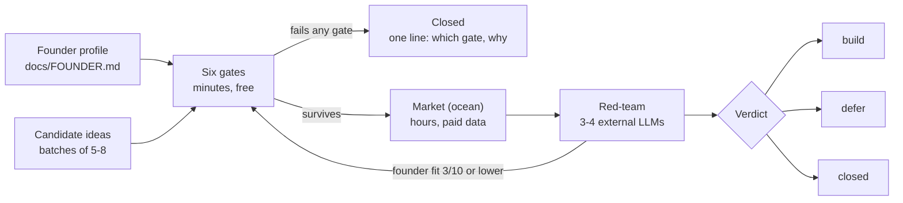

# idea-gates

A Claude Code skill that kills infeasible ideas **before** you spend money on market research.

Most idea checks start with the market: demand, competitors, CPC. That is the expensive part.
This skill starts with a cheaper question: *can you, specifically, take the first step?*

## The six gates

Each gate is scored against your own founder profile (`docs/FOUNDER.md`), not an imaginary founder.

| # | Gate | Question |
|---|---|---|
| 1 | First step | Can you physically take the first action, with your language, location and legal entity? |
| 2 | Trust | Does the customer have to trust *you personally* before buying? |
| 3 | Small-customer math | Does the unit economics work with your smallest realistic customer? |
| 4 | Measurability | Can the load-bearing number be measured from public data within your budget? |
| 5 | Channel | Can you reach customers through a channel you will actually use? |
| 6 | Regulation | What regulatory risk would end the project, and how likely is it? |

Only survivors move on: market analysis, then a red-team pass through external LLMs, then a verdict.



## The case that made it

A marketplace-seller service in Brazil had real demand (about 24K searches a month), a winnable
search page and working, tested code. It died on gate 1: the first step required a stranger to give
a foreigner access to their business finances. That check takes ten minutes. The market analysis took weeks.

## Install

From your project root:

```sh
git clone https://github.com/kabluk/idea-gates .claude/skills/idea-gates
```

(Or clone into `~/.claude/skills/idea-gates` to make it available in every project.)

Copy `templates/FOUNDER.example.md` to `docs/FOUNDER.md` and fill it in — or let the skill ask you
the questions on the first run and write the file for you.

The optional measurement scripts in `scripts/` need Node.js 18+ and DataForSEO credentials in
`DATAFORSEO_LOGIN` / `DATAFORSEO_PASSWORD`; see `scripts/README.md`.

Then in Claude Code: *"Run idea-gates on: an AI bookkeeping assistant for Etsy sellers."*

## How I built this with AI agents

The skill was written and refined with Claude Code, one post-mortem at a time: each gate, trap and
data-hygiene rule was added after a real idea died or a real measurement turned out to be wrong.
I supplied the failures and the judgement; the agents drafted the rules, tested the scripts against
live data and rewrote both until they would have caught the original mistake.

## License

MIT
